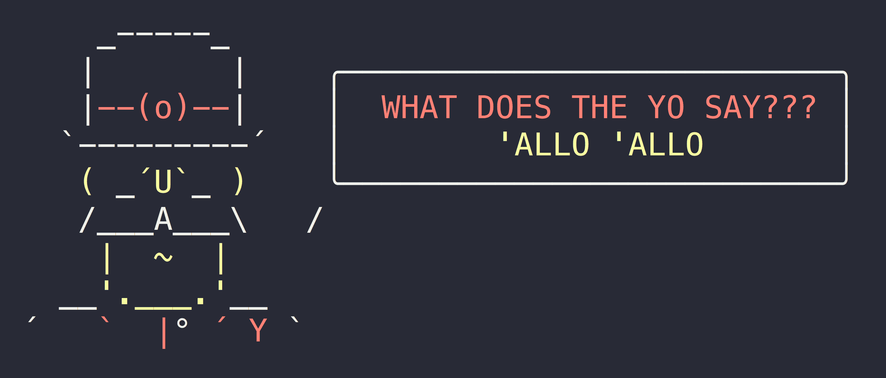

# yosay

> Tell Yeoman what to say

Like [cowsay](https://en.wikipedia.org/wiki/Cowsay), but less cow.



## Install

```sh
npm install yosay
```

## Usage

```js
import yosay from 'yosay';

console.log(yosay('Hello, and welcome to my fantastic generator full of whimsy and bubble gum!'));

/*
     _-----_     ╭──────────────────────────╮
    |       |    │ Hello, and welcome to my │
    |--(o)--|    │ fantastic generator full │
   `---------´   │   of whimsy and bubble   │
    ( _´U`_ )    │           gum!           │
    /___A___\   /╰──────────────────────────╯
     |  ~  |
   __'.___.'__
 ´   `  |° ´ Y `
*/
```

*You can style your text with [`chalk`](https://github.com/chalk/chalk) before passing it to `yosay`.*

## CLI

```sh
npm install --global yosay
```

```
$ yosay --help

  Usage
    $ yosay <string>
    $ yosay <string> --maxLength 8
    $ echo <string> | yosay

  Example
    $ yosay 'Sindre is a horse'

     _-----_
    |       |
    |--(o)--|    ╭──────────────────────────╮
   `---------´   │     Sindre is a horse    │
    ( _´U`_ )    ╰──────────────────────────╯
    /___A___\   /
     |  ~  |
   __'.___.'__
 ´   `  |° ´ Y `
```
